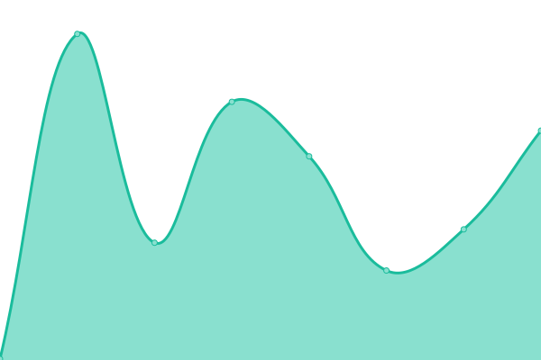
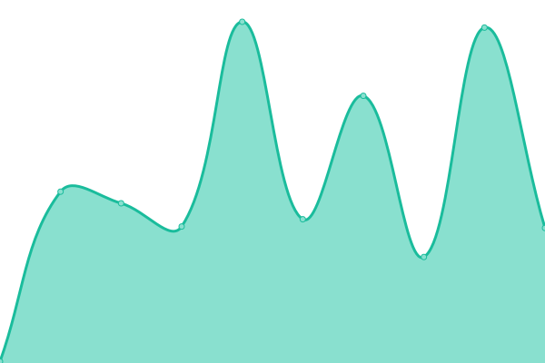

# [📈 Live Status](https://demo.upptime.js.org): <!--live status--> **🟧 Partial outage**

This repository contains the open-source uptime monitor and status page for [b00nw33](https://demo.upptime.js.org), powered by [Upptime](https://github.com/upptime/upptime).

With [Upptime](https://upptime.js.org), you can get your own unlimited and free uptime monitor and status page, powered entirely by a GitHub repository. We use [Issues](https://github.com/b00nw33/upptime/issues) as incident reports, [Actions](https://github.com/b00nw33/upptime/actions) as uptime monitors, and [Pages](https://demo.upptime.js.org) for the status page.

<!--start: status pages-->
<!-- This summary is generated by Upptime (https://github.com/upptime/upptime) -->
<!-- Do not edit this manually, your changes will be overwritten -->
<!-- prettier-ignore -->
| URL | Status | History | Response Time | Uptime |
| --- | ------ | ------- | ------------- | ------ |
|  [CC-Jekyll on Netlify](https://cc-jekyll.netlify.app) | 🟩 Up | [cc-jekyll-on-netlify.yml](https://github.com/b00nw33/upptime/commits/HEAD/history/cc-jekyll-on-netlify.yml) | 

 177ms
     
 | 

<a href="https://demo.upptime.js.org/history/cc-jekyll-on-netlify">100.00%</a>
    

|  [td-streamlit on Render](https://td-streamlit.onrender.com) | 🟩 Up | [td-streamlit-on-render.yml](https://github.com/b00nw33/upptime/commits/HEAD/history/td-streamlit-on-render.yml) | 

 5005ms
     
 | 

<a href="https://demo.upptime.js.org/history/td-streamlit-on-render">99.41%</a>
    

|  [CF-Jekyll on Vercel](https://cf-jekyll.vercel.app) | 🟩 Up | [cf-jekyll-on-vercel.yml](https://github.com/b00nw33/upptime/commits/HEAD/history/cf-jekyll-on-vercel.yml) | 

 91ms
     
 | 

<a href="https://demo.upptime.js.org/history/cf-jekyll-on-vercel">100.00%</a>
    

|  [CF-Jekyll on Github](https://b00nw33.github.io/cf-jekyll) | 🟩 Up | [cf-jekyll-on-github.yml](https://github.com/b00nw33/upptime/commits/HEAD/history/cf-jekyll-on-github.yml) | 

 128ms
     
 | 

<a href="https://demo.upptime.js.org/history/cf-jekyll-on-github">100.00%</a>
    

|  [CF-Jekyll on CloudFlare](https://cf-jekyll.pages.dev) | 🟩 Up | [cf-jekyll-on-cloud-flare.yml](https://github.com/b00nw33/upptime/commits/HEAD/history/cf-jekyll-on-cloud-flare.yml) | 

 113ms
     
 | 

<a href="https://demo.upptime.js.org/history/cf-jekyll-on-cloud-flare">100.00%</a>
    

|  [CF-Svelte on CloudFlare](https://cf-svelte-b98.pages.dev) | 🟩 Up | [cf-svelte-on-cloud-flare.yml](https://github.com/b00nw33/upptime/commits/HEAD/history/cf-svelte-on-cloud-flare.yml) | 

 113ms
     
 | 

<a href="https://demo.upptime.js.org/history/cf-svelte-on-cloud-flare">100.00%</a>
    

|  [CF-NextJS on CloudFlare](https://cf-nextjs-014.pages.dev) | 🟩 Up | [cf-next-js-on-cloud-flare.yml](https://github.com/b00nw33/upptime/commits/HEAD/history/cf-next-js-on-cloud-flare.yml) | 

 139ms
     
 | 

<a href="https://demo.upptime.js.org/history/cf-next-js-on-cloud-flare">100.00%</a>
    

|  [CF-NextJS on Vercel](https://cf-nextjs.vercel.app) | 🟩 Up | [cf-next-js-on-vercel.yml](https://github.com/b00nw33/upptime/commits/HEAD/history/cf-next-js-on-vercel.yml) | 

 83ms
     
 | 

<a href="https://demo.upptime.js.org/history/cf-next-js-on-vercel">100.00%</a>
    

|  [NextJS on Vercel](https://td-nextjs.vercel.app) | 🟩 Up | [next-js-on-vercel.yml](https://github.com/b00nw33/upptime/commits/HEAD/history/next-js-on-vercel.yml) | 

 100ms
     
 | 

<a href="https://demo.upptime.js.org/history/next-js-on-vercel">100.00%</a>
    

|  [NextJS on Render](https://td-nextjs.onrender.com) | 🟥 Down | [next-js-on-render.yml](https://github.com/b00nw33/upptime/commits/HEAD/history/next-js-on-render.yml) | 

 2698ms
     
 | 

<a href="https://demo.upptime.js.org/history/next-js-on-render">99.81%</a>
    

|  [Flask on Vercel](https://td-flask.vercel.app) | 🟩 Up | [flask-on-vercel.yml](https://github.com/b00nw33/upptime/commits/HEAD/history/flask-on-vercel.yml) | 

 921ms
     
 | 

<a href="https://demo.upptime.js.org/history/flask-on-vercel">100.00%</a>
    

|  [Flask on Render](https://td-flask.onrender.com) | 🟩 Up | [flask-on-render.yml](https://github.com/b00nw33/upptime/commits/HEAD/history/flask-on-render.yml) | 

 6499ms
     
 | 

<a href="https://demo.upptime.js.org/history/flask-on-render">99.51%</a>
    

<!--end: status pages-->

[**Visit our status website →**](https://demo.upptime.js.org)

## 📄 License

- Powered by: [Upptime](https://github.com/upptime/upptime)
- Code: [MIT](./LICENSE) © [Anand Chowdhary](https://anandchowdhary.com), supported by [Pabio](https://pabio.com)
- Data in the `./history` directory: [Open Database License](https://opendatacommons.org/licenses/odbl/1-0/)
